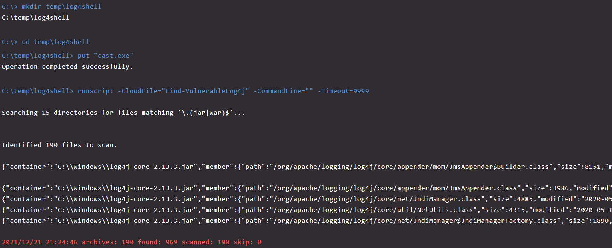

# Running `Find-VulnerableLog4J.ps1` via Windows RTR shell

## Background

* `CAST` is a cross-platform utility written in Go that will examine archive files and compare the SHA256 hash against a list of class files known to be vulnerable to [CVE-2021-44228](https://nvd.nist.gov/vuln/detail/CVE-2021-44228). 
* `Find-VulnerableLog4J.ps1` is a PowerShell script intended to identify locations where JAR files are likely to be found and passing those filepaths to `CAST` for analysis. It does this through two methods:

  * Running process directories
  * Install paths per installed software from WMI

## Instructions

1. Upload the CAST executable from the Releases page to Response Scripts & Files (https://falcon.crowdstrike.com/configuration/real-time-response/tools/files) as a "Put" file

2. Upload [Find-VulnerableLog4J.ps1](./Find-VulnerableLog4J.ps1) as a Response Script (https://falcon.crowdstrike.com/configuration/real-time-response/tools/scripts)

* Make sure to update `$TempDirectoryPath` to the directory where `cast.exe` will be uploaded

3. Initiate Host RTR Shell via Host Management (https://falcon.crowdstrike.com/hosts/hosts)

* Require response policies to have put files and runscript to be enabled.
* User must have RTR administrator (runscript permissions)

### Manual RTR Shell

4. Create the directory where you upload `cast.exe`

* `mkdir {SOME_DIRECTORY_NAME} (example: mkdir CS)`
* `cd {SOME_DIRECTORY_NAME}`

5. Upload `cast.exe` to the host

* `put "cast.exe"`

6. Execute `Find-VulnerableLog4J.ps1`

* `runscript -CloudFile="Find-VulnerableLog4j" -CommandLine="" -Timeout=9999`
* _Make sure to set a long timeout value as this script may take a while to execute_

7. Review output from the tool

* JSON entries indicate identified vulnerable class files
* `cast_results.json` (if present) will contain the same information that was written to standard output
* `cast.exe` will automatically be deleted from the host

